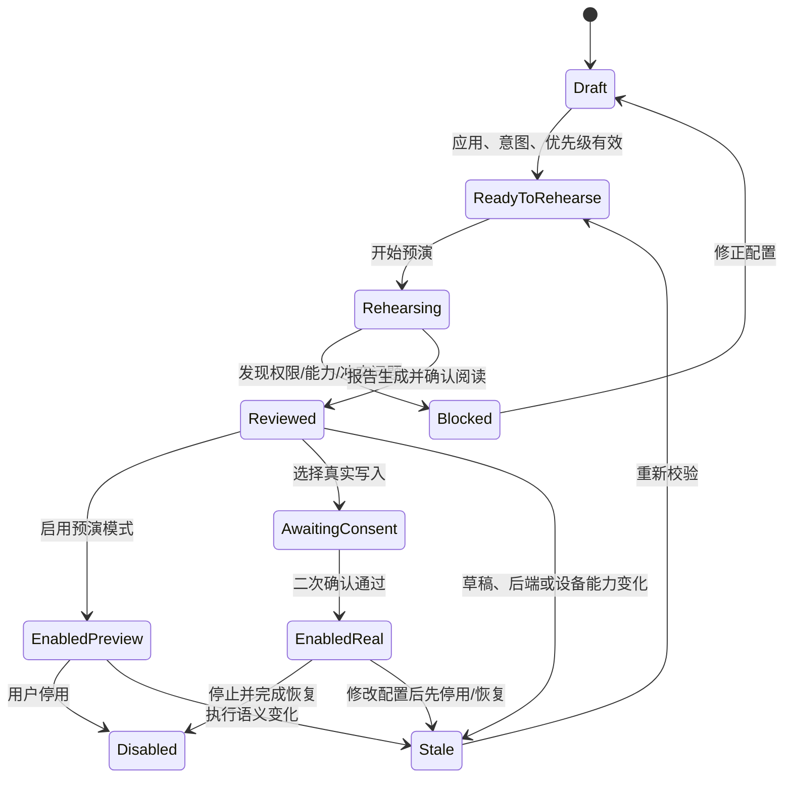
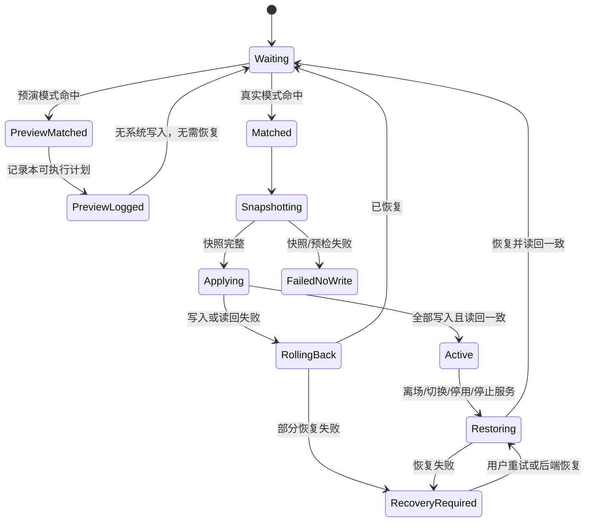

# 方案 A：场景链路工作台

## 1. 定位

“场景链路工作台”是 M3 的核心体验，用一条可观察、可预演、可恢复的链路替代传统参数表单：

> 应用 → 意图 → 优先级 → 预演 → 启用 → 命中 → 恢复

用户不需要理解 C0-C5 或底层 sysfs 路径，只需要回答七个问题：对哪个应用、希望得到什么效果、与其他规则谁优先、实际会发生什么、是否允许自动执行、当前为何命中、退出后是否已恢复。

工作台不是旧版功能菜单的重排，也不是通用 shell 编排器。它只组织栖境声明支持的结构化意图、能力预检、生命周期和审计结果。

## 2. 入口与页面结构

### 2.1 入口

- “应用”栏选择应用后进入工作台，并携带应用名称、包名和图标上下文。
- “场景”栏点击新建、编辑或当前命中场景后进入工作台。
- “总览”的当前场景和异常恢复提示可深链到工作台的“命中”或“恢复”阶段。

### 2.2 页面层级

“场景”栏保留两层结构：

1. **场景列表**：当前命中摘要、启用/停用筛选、场景卡片和新建入口。
2. **链路工作台**：顶部显示七阶段链路，正文一次聚焦当前阶段，同时允许回看已完成阶段。

手机端不把七个阶段做成新的底部导航。阶段轨道用于表达进度和状态；底部主操作始终对应当前阶段，例如“定义意图”“开始预演”“启用预演”“确认并启用真实执行”。

## 3. 七阶段契约

| 阶段 | 用户输入/系统信息 | 完成条件 | 关键阻断 |
| --- | --- | --- | --- |
| 应用 | 一个或多个目标包名；主应用名称与图标 | 至少一个仍可识别的目标应用 | 包名为空、应用已卸载且未确认保留 |
| 意图 | CPU 策略/频率范围、swappiness 等结构化目标 | 至少一个非空且格式正确的意图 | 参数越界、目标能力明确不支持 |
| 优先级 | 数值优先级、同应用候选场景及胜出解释 | 对每个重叠应用都能解释唯一胜出者 | 相同应用存在未处理的同优先级冲突 |
| 预演 | 模式、后端、能力矩阵、当前值、计划值、恢复条件 | 生成与当前草稿/设备/后端一致的预演报告 | 权限缺失、快照不可读、白名单不支持、报告已过期 |
| 启用 | 预演模式或真实写入模式；风险确认 | 保存启用状态及所绑定的执行语义 | 未预演、报告过期；真实模式未二次确认 |
| 命中 | 当前前台应用、候选集合、胜出场景、执行结果 | 记录“为何命中”及实际运行状态 | Usage Stats 不可用、后端失效、事务失败 |
| 恢复 | 原值、恢复触发原因、逐项结果 | 所有已写入项恢复并读回验证，或明确列出未恢复项 | 恢复命令缺失、权限撤销、读回不一致 |

“保存草稿”“预演通过”和“启用”是三个不同动作。保存草稿不启动自动化；预演通过不代表系统已修改；启用后也只有在前台应用实际匹配时才产生一次命中。

## 4. 优先级与匹配规则

1. 只从已启用且包含当前前台包名的场景中选择候选。
2. 数值越高优先级越高；工作台必须展示所有重叠候选和胜出原因。
3. 同一包名下的相同优先级视为待解决冲突。草稿可以保存，但不能真实启用，用户必须调整优先级或停用冲突场景。
4. 选择器在最高优先级出现并列时必须返回冲突并拒绝执行，不能按 id 静默选择。
5. 同一场景重复收到相同前台事件时去重，不重复快照或写入。
6. 从场景 A 切到场景 B 时，先完成 A 的恢复，再为 B 读取新快照并应用；A 恢复失败时不得继续应用 B。

预演应支持“如果现在打开某应用”模拟：列出所有候选、被跳过原因、最终胜出者和计划动作，但不伪造真实前台命中事件。

## 5. 工作台状态机

### 5.1 编排状态

预演报告必须绑定场景内容、目标包名、意图、优先级和当时继承的全局执行方式。当前实现直接保存预演对应的不可变 `SceneProfile` 和后端，并用请求序号处理异步竞态；编辑草稿或发起新请求会立即作废旧结果。后续再补设备能力摘要与可持久化报告指纹。

### 5.2 运行状态

“命中”只表示选择器找到了场景，不表示已经应用成功。UI 必须继续显示 `预检中、建立快照、应用中、已生效、恢复中、已恢复、需要处理` 中的实际状态。

## 6. 专属组件

这些组件是工作台的产品语义，不应退化成通用卡片加一段文字。

| 组件 | 职责 | 必须呈现的信息 |
| --- | --- | --- |
| `SceneChainRail` 链路轨道 | 表达七阶段位置与完整度 | 当前阶段、已完成、阻断、已过期、运行中、需恢复；状态不只靠颜色 |
| `TargetAppCluster` 应用目标组 | 选择和核对作用对象 | 图标、名称、包名、用户/系统应用、卸载状态、移除动作 |
| `IntentRecipe` 意图配方 | 用目标语言组织调节项 | 当前意图、设备支持范围、推荐/自定义标记、不支持原因 |
| `PriorityResolver` 优先级解析器 | 处理重叠规则 | 数值、重叠应用、候选场景、胜出解释、冲突修复入口 |
| `RehearsalReport` 预演报告 | 汇总启用前证据 | 模式、后端、权限、原值→目标值、预计命令数、快照/恢复可用性、阻断项、报告时间与过期状态 |
| `EnableGate` 启用闸门 | 分开预演启用与真实启用 | 执行语义、风险摘要、二次确认状态、不能启用的具体原因 |
| `LiveHitCard` 命中卡 | 解释当前运行状态 | 前台应用、场景、胜出原因、模式/后端、命中时间、事务状态、停止并恢复入口 |
| `RecoveryLedger` 恢复账本 | 让恢复结果可追溯 | 触发原因、原值、已恢复/未恢复项、实际读回、重试与任务日志入口 |
| `ChainEventTimeline` 链路时间线 | 串联一次完整经历 | 保存、预演、启用、命中、写入、恢复事件及关联 task id |

空状态也属于组件契约。例如没有应用时引导“从应用栏选择”，没有意图时引导“添加至少一个目标”，没有命中时说明正在等待什么，而不是显示空白卡片。

## 7. 预演与真实写入语义

### 7.1 预演（dry-run）

- 允许读取普通设备状态、检查参数、白名单、权限和冲突，并生成将要执行的结构化计划。
- 命中时只记录“如果是真实模式将执行什么”，不调用系统写入，不产生 `Active`，恢复阶段显示“未修改系统，无需恢复”。
- 所有结果使用“预演通过、预演命中、计划可执行”等文案，不使用“已应用、已生效、已恢复”。
- 预演仍可能被阻断；无法读取当前值或不支持的 capability 必须如实显示，不能用假值补齐成功报告。

### 7.2 真实写入

- 启用前必须完成能力预检、原值可读验证和高风险二次确认，确认信息遵循 [后端与恢复验收标准](backend-acceptance.md)。
- 第一版执行方式仍由全局环境统一选择，场景不能自行选择后端；预演报告记录当时继承的 `ROOT`、`SHIZUKU` 或 `DRY_RUN`，只作为授权证据。
- 全局执行方式改变时，所有已启用场景必须先停用并标记“需重新预演”。尤其不能让预览环境下启用的场景因全局切换而静默获得真实写入权限。
- 真实命中必须遵循“整批预检 → 完整快照 → 顺序写入 → 逐项读回”。任一步失败按已写入项逆序恢复。
- 离开目标应用、切换场景、停用场景、停止服务或前台事件源失效时触发恢复。恢复成功前不删除快照。

### 7.3 启用闸门

真实启用按钮只在以下条件同时满足时可用：

1. 目标应用、意图和优先级校验通过，没有未处理冲突。
2. 预演报告与当前草稿、设备、后端和模式指纹一致。
3. 所有计划 capability 在所选后端的白名单内，原值可读取且恢复命令可生成。
4. Root/Shizuku 当前已授权且 transport 可用。
5. 当前不存在运行中事务或未处理的 `RecoveryRequired`。

## 8. 数据与事件契约

工作台最终需要把“配置”与“运行”分开保存：

- **场景配置**：id、名称、目标应用、结构化意图、优先级、启用状态和内容版本。
- **预演记录**：场景版本、设备/能力摘要、当时继承的全局执行方式、计划、阻断/警告、指纹和生成时间。
- **运行记录**：前台包名、候选与胜出原因、task id、命中时间、计划指纹、应用/读回结果。
- **恢复记录**：原始快照、恢复触发原因、逐项尝试与读回、未恢复项、最近重试时间。

任务日志不得记录任意 shell、授权令牌或无关应用活动。场景事件只保存完成链路解释和故障恢复所必需的信息。

## 9. 当前能力边界

### 9.1 已有基础

- 应用列表可携带包名进入场景编辑；场景支持保存、列表展示、启停和编辑。
- `SceneProfile` 已有目标包名、CPU/内存意图、优先级和启用状态；`SceneSelector` 已按优先级选择并稳定去重。
- Usage Stats 事件源、轮询和前台服务已能触发进程内场景生命周期。
- 场景引擎已有整批预检、快照完整性阻断、写入失败逆序回滚和任务日志。
- 当前真实白名单覆盖 CPU governor、最低/最高频率和 swappiness；Root/Shizuku transport 已有实现基础，仍以真机能力为准。
- dry-run、Root、Shizuku 已有显式后端概念；debug 模拟覆盖快照、故障和恢复，不代表真实硬件通过。

### 9.2 已实现的工作台 MVP

- 应用对象连续进入场景编辑，提供意图轨道、自定义参数、优先级、重叠冲突提示、预演报告和风险匹配的启用确认。
- 草稿普通保存固定为未启用；只有与当前场景内容及执行方式完全一致的成功预演才能进入启用入口。
- 异步预演绑定请求版本；编辑期间返回的旧结果会被丢弃，异常和取消不会让页面永久停留在“预演中”。
- 全局执行方式变更会停用场景；服务处于运行、恢复中或恢复未确认状态时，执行方式被持久状态锁定。
- 真实后端必须提供完整原值快照；空调节意图、缺快照、未知能力和最高优先级并列均在零写入阶段拒绝。

### 9.3 仍需实现

- 当前命中、逐阶段应用进度、胜出原因和恢复账本 UI。
- 预演报告的设备能力摘要、持久化指纹和跨页面回看。
- 未完成事务与原始快照的跨进程 journal；当前进程异常中断会进入 `RECOVERY_REQUIRED` 并锁住真实执行，但还不能自动重建丢失的恢复命令。
- 真机 Root/Shizuku 写入、读回、离场恢复和授权撤销验收。

### 9.4 当前明确关闭

- ZRAM 重建、压缩算法/容量真实写入、CPU 核心在线切换。
- 任意 shell、用户自定义脚本、厂商未知路径写入和 daemon 执行。
- 无快照写入、未验证能力的强制启用、从 dry-run 静默升级为真实写入。

## 10. 未来能力边界

以下能力可以沿链路模型扩展，但不是第一版工作台完成条件：

- 时间、充电状态、温度、网络等复合触发器，以及多个条件的可视化逻辑。
- 保守/均衡/性能等经设备能力校准的意图模板和模板对比。
- 场景版本、复制、批量调整优先级和导入/导出新格式。
- 命中期间关联 FPS session，在恢复后对比体验与能耗，但不得把相关性描述为因果结论。
- 更丰富的恢复中心、跨设备配置同步和经过认证的 daemon 后端。

未来扩展继续使用“应用 → 意图 → 决策 → 预演 → 执行 → 恢复”契约，不在工作台中加入在线脚本商店、旧数据导入或任意命令终端。

## 11. 第一版验收路径

1. 从“应用”选择目标 → 自动带入工作台 → 定义意图和优先级 → 保存草稿，全程不写系统。
2. 同一应用存在两个相同优先级场景 → 预演明确阻断 → 调整后显示唯一胜出者。
3. dry-run 预演并启用 → 前台命中 → 显示计划和“无需恢复” → 系统值未改变。
4. 修改已预演场景或切换后端 → 报告立即过期 → 真实启用按钮禁用。
5. 真实模式预演 → 二次确认 → 命中 → 快照/应用/读回可观察 → 离场后逐项恢复。
6. 写入中途失败 → 显示已恢复或部分恢复失败 → 恢复账本与任务日志能关联同一链路。
7. 启用场景后撤销授权、停止服务或杀死进程 → 不产生新的静默写入，并按既定恢复策略处理或给出醒目告警。
8. TalkBack、200% 字体和小屏下，七阶段状态、阻断原因、主操作和恢复告警仍可理解和操作。
